# University Library Database System

This project was completed as part of a final project in for Database Technology course. It is a university library database management system built using MySQL/MariaDB in XAMPP. This project implements database design, indexing, transactions, security, triggers, stored procedures, and query optimization techniques.

---

# Features

- Book management
- User management
- Loan and reservation system
- Transactions and concurrency control
- Indexing and query optimization
- Role-based access control (RBAC)
- Triggers and stored procedures
- Memory management tuning
- Backup and recovery planning

---

# Database Design

## ERD
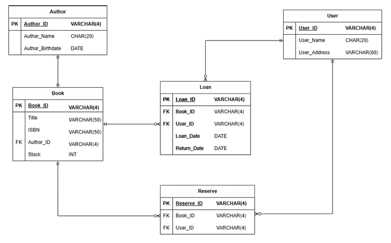

## Main Entities

### Book
- Book_ID
- Title
- ISBN
- Author_ID
- Stock

### Author
- Author_ID
- Author_Name
- Author_Birthdate

### User
- User_ID
- User_Name
- User_Address

### Loan
- Loan_ID
- User_ID
- Book_ID
- Loan_Date
- Return_Date

### Reserve
- Reserve_ID
- User_ID
- Book_ID

## Entities Relationship

* **Author ➔ Book:** One-to-Many relationship linked via `Author_ID`.
* **Book ➔ Loan / Reserve:** Many-to-One relationships linked via `Book_ID`.
* **User ➔ Loan / Reserve:** Many-to-One relationships linked via `User_ID`.


---

# Technologies Used

- MySQL / MariaDB
- XAMPP
- phpMyAdmin

---

# Storage Engine and Tablespaces

The database uses the InnoDB storage engine because it supports:

- Transactions (ACID compliance)
- Foreign key constraints
- Row-level locking
- Crash recovery
- Better concurrency control

`innodb_file_per_table` was enabled so each table has its own `.ibd` data file.

Configuration:

```sql
SET GLOBAL INNODB_file_per_table = ON;
```

---

# Indexing and Query Optimization

Indexes were created to improve query performance for common operations such as:

- Searching books by title
- Searching books by author
- Finding loans by user
- Finding overdue loans
- Finding reservations by user/book

Indexes:

**1. Common Operation**
   Find books by title
    ```sql
    CREATE INDEX idx_book_title ON book(Title);
    ```
    
    Query performance was analyzed using:
    
    ```sql
    EXPLAIN SELECT * FROM book WHERE Title = 'Bad.';
    ```
    
    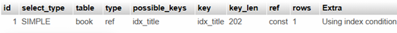

**2. Loan Operations**
    * Find loan for user  
      ```sql
      CREATE INDEX idx_loan_user ON loan(User_ID);
      ```
      
      Query performance was analyzed using:
        
      ```sql
      EXPLAIN SELECT * FROM loan WHERE User_ID = '8425';
      ```

      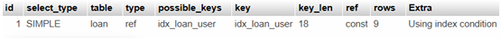

    * Find loan for book
      ```sql
      CREATE INDEX idx_loan_book ON loan(Book_ID);
      ```
  
      Query performance was analyzed using:
        
      ```sql
      EXPLAIN SELECT * FROM loan WHERE Book_ID = '3115';
      ```

      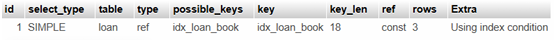
  
    * Find overdue loan
      ```sql
      CREATE INDEX idx_loan_return ON loan(Return_Date);
      ```
      
      Query performance was analyzed using:
        
      ```sql
      EXPLAIN SELECT * FROM loan WHERE Return_Date < NOW();
      ```
  
      

**3. Reserve Operation**
   ```sql
   CREATE INDEX idx_reserve_book ON reserve(Book_ID);
   CREATE INDEX idx_reserve_user ON reserve(User_ID);
   ```      
---

# Memory Management

The following configurations were used to optimize performance:

```sql
SET GLOBAL innodb_buffer_pool_size = 512 * 1024 * 1024;

SET GLOBAL query_cache_size = 64 * 1024 * 1024;

SET GLOBAL query_cache_type = 1;
```

## Explanation

- Buffer pool size set to 512MB to improve data caching and reduce disk access.
- Query cache size set to 64MB to speed up repeated SELECT queries.
- Query cache type enabled caching for repeated queries.

Performance improvements were observed through increased:
- Qcache_hits
- Qcache_inserts


---

# Transactions and Concurrency Control

Implemented transactions include:

- Borrow a Book
- Return a Book
- Reserve a Book
- Add New Book
- Delete User Account

Transactions:

**1. Borrow Book**
   ```sql
   START TRANSACTION;
   
   SELECT stock  
   FROM book  
   WHERE book_id = 4169; 
   INSERT INTO loan (Loan_ID, User_ID, Book_ID, Loan_Date, Return_Date)  
   VALUES (2112, 585, 4169, NOW(), NULL); 
   UPDATE book  
   SET stock = stock - 1  
   WHERE book_id = 4169; 
   
   COMMIT;
   ```

   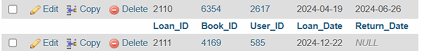

**2. Return Book**
   ```sql
   START TRANSACTION;
   
   SELECT Loan_ID, Book_ID, User_ID, Return_Date
   FROM loan
   WHERE Book_ID = 4169 AND User_ID = 585 AND Return_Date IS NULL;
   UPDATE loan
   SET Return_Date = '2024-12-23'
   WHERE Book_ID = 4169 AND User_ID = 585 AND Return_Date IS NULL;
   UPDATE book
   SET Stock = Stock + 1
   WHERE Book_ID = 4169; 
   
   COMMIT;
   ```

   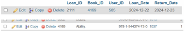

**3. Reserve Book**
   ```sql
   START TRANSACTION;
   
   SELECT stock
   FROM book
   WHERE Book_ID = 2413;
   INSERT INTO reserve (Reserve_ID, User_ID, Book_ID)
   VALUES (3011, 9366, 2413);  
   
   COMMIT;
   ```

   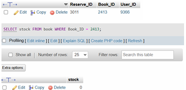

**4. Add New Book**
   ```sql
   START TRANSACTION;
   
   INSERT INTO book (Book_ID, Title, ISBN, Author_ID, Stock)
   VALUES (1234, 'Hello.', '978-3-16-148410-0', 1011, 5); 
   
   COMMIT;
   ```

   

**5. Delete User Account**
   ```sql
   START TRANSACTION;
   
   SELECT COUNT(*) AS outstanding_loan
   FROM loan
   WHERE User_ID = 3554 AND (Return_Date IS NULL OR Return_Date >
   CURDATE());

   SELECT COUNT(*) AS reservation_list
   FROM reserve
   WHERE User_ID = 3554;

   DELETE FROM loan
   WHERE User_ID = 3554;

   DELETE FROM User
   WHERE User_ID = 3554; 
   
   COMMIT;
   ```

   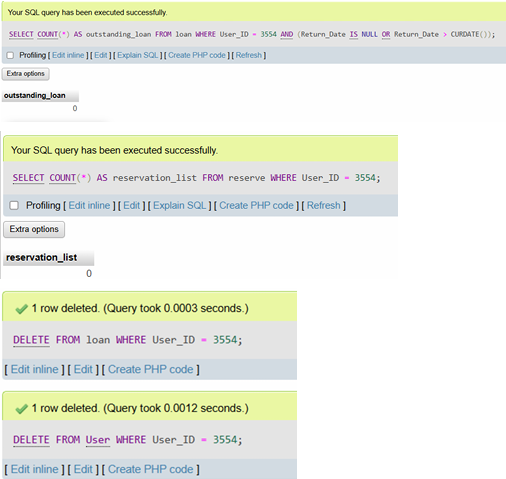

---

# Security and Backup

## User Roles

### Admin
Full database access

```sql
CREATE USER 'admin'@'localhost' IDENTIFIED BY 'admin_password';

GRANT ALL PRIVILEGES ON *.* TO 'admin'@'localhost';

SHOW GRANTS FOR 'admin'@'localhost';
```


### Librarian
- SELECT
- INSERT
- UPDATE
- DELETE

```sql
CREATE USER 'librarian'@'localhost' IDENTIFIED BY 'librarian_password';

GRANT SELECT, INSERT, UPDATE, DELETE ON library.* TO 'librarian'@'localhost';

SHOW GRANTS FOR 'librarian'@'localhost';
```

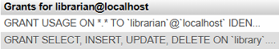

### Student
Read-only access to books

```sql
CREATE USER 'student'@'localhost' IDENTIFIED BY 'student_password';

GRANT SELECT ON library.book TO 'student'@'localhost';

SHOW GRANTS FOR 'student'@'localhost';
```

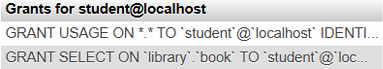


## Backup

Database backup using:

```bash
mysqldump -u root -p library > library_backup.sql
```

Restore using:

```bash
mysql -u root -p library < library_backup.sql
```

---

# Advanced Features

**Action 1: Catalog Browsing / Inventory View**

```sql
SELECT b.Book_ID, b.Title, b.ISBN, a.Author_ID, a.Author_Name
FROM author a
JOIN book b ON a.Author_ID = b.Author_ID;
```

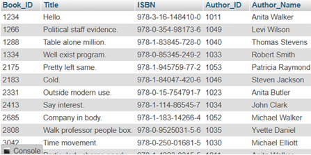


**Action 2: Active Overdue / Outstanding Loans Tracker**

```sql
SELECT u.User_Name, b.Title, l.Loan_ID, l.Loan_Date, l.Return_Date
FROM loan l
JOIN book b ON l.Book_ID = b.Book_ID
JOIN user u ON l.User_ID = u.User_ID
WHERE Return_Date IS NULL;
```


**Action 3: Complete Transaction Audit Trail**

```sql
SELECT b.Book_ID, b.Title, a.Author_Name, a.Author_Birthdate, b.ISBN, u.User_ID, u.User_Name, u.User_Address, l.Loan_ID, l.Loan_Date, l.Return_Date
FROM book b
JOIN loan l ON l.Book_ID = b.Book_ID
JOIN user u ON l.User_ID = u.User_ID
JOIN author a ON b.Author_ID = a.Author_ID;
```

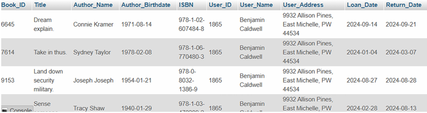

## Trigger Example

Automatically update stock after a book is returned:

```sql
CREATE TRIGGER AfterReturnUpdate
AFTER INSERT ON loan
FOR EACH ROW
UPDATE book
SET Stock = Stock - 1
WHERE Book_ID = NEW.Book_ID;

CREATE TRIGGER AfterReturnUpdate 
AFTER UPDATE ON loan 
FOR EACH ROW 
UPDATE book 
SET Stock = Stock + 1 
WHERE Book_ID = NEW.Book_ID AND NEW.Return_Date IS NOT NULL;

SHOW TRIGGERS;
```

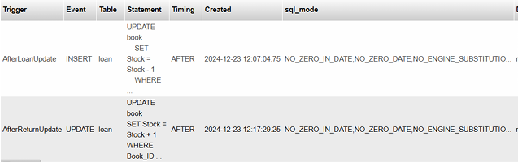

---

# How to Run

1. Start Apache and MySQL in XAMPP
2. Open phpMyAdmin
3. Import the SQL files
4. Import and execute the `library.sql` file

---
